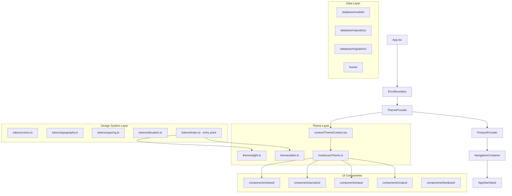
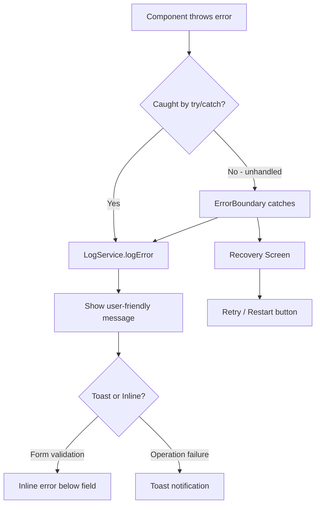

# Design Document: App Modernization

## Overview

This design covers the comprehensive modernization of the Papalia Inventory React Native application. The modernization introduces a centralized "liquid" design system with design tokens, light/dark theme support, component architecture refactoring, accessibility compliance, dependency security updates, cross-platform compatibility, business domain alignment, UI/UX improvements, performance optimization, and standardized error handling.

The current app uses a flat `globalStyles.ts` with hardcoded colors, no theming infrastructure, multiple components per file, no accessibility attributes, a vulnerable `xlsx` dependency, Android-only file handling, misspelled directories/columns, basic loading indicators, no pagination, and inconsistent error handling via `Alert.alert()`.

The modernization transforms this into a well-structured, accessible, themed, performant, and secure application while preserving all existing warehouse management functionality.

## Architecture

### High-Level Architecture



### Key Architectural Decisions

1. **Design tokens as plain TypeScript objects** — No runtime overhead, full type safety, tree-shakeable. Tokens are the single source of truth for all visual values.

2. **ThemeProvider via React Context** — Wraps the entire app, provides the active theme object to all components via `useTheme()` hook. Persists preference to AsyncStorage (via `@react-native-async-storage/async-storage`).

3. **One component per file** — Enforced by extracting inline components (HeaderRight, HeaderLeft) into dedicated files. Improves code navigation and testability.

4. **ExcelJS replaces xlsx** — The `exceljs` library has no known HIGH/CRITICAL vulnerabilities and supports streaming writes suitable for React Native with `react-native-fs`.

5. **TypeORM migrations for schema changes** — The `commets` → `comments` column rename uses a new migration that preserves existing data via `ALTER TABLE ... RENAME COLUMN`.

6. **Platform-adaptive file paths** — A `FileService` abstraction resolves platform-specific directories (Downloads on Android, Documents on iOS) and handles permission requests.

7. **Error boundaries + centralized logging** — A top-level `ErrorBoundary` catches unhandled errors. A `LogService` records structured error entries (timestamp, type, source, operation).

8. **Pagination via FlatList windowing** — Uses `initialNumToRender`, `maxToRenderPerBatch`, `windowSize`, and `onEndReached` for incremental loading when lists exceed 50 items.

## Components and Interfaces

### Design System Module

```typescript
// src/design-system/tokens/colors.ts
export interface ColorPalette {
  primary: string;
  secondary: string;
  background: string;
  surface: string;
  error: string;
  success: string;
  warning: string;
}

export interface SemanticColors {
  stockAvailable: string;
  stockDepleted: string;
  entryMovement: string;
  exitMovement: string;
  successFeedback: string;
  warningFeedback: string;
  errorFeedback: string;
}

// src/design-system/tokens/typography.ts
export interface TypographyLevel {
  fontSize: number;
  fontWeight: 'normal' | 'bold' | '500' | '600' | '700';
  lineHeight: number;
}

export interface TypographyScale {
  h1: TypographyLevel;
  h2: TypographyLevel;
  body: TypographyLevel;
  caption: TypographyLevel;
  overline: TypographyLevel;
}

// src/design-system/tokens/spacing.ts
export interface SpacingScale {
  xs: number;  // 4
  sm: number;  // 8
  md: number;  // 16
  lg: number;  // 24
  xl: number;  // 32
  xxl: number; // 48
}

// src/design-system/tokens/elevation.ts
export interface ElevationLevel {
  shadowColor: string;
  shadowOffset: { width: number; height: number };
  shadowOpacity: number;
  shadowRadius: number;
  elevation: number;
}

export interface ElevationScale {
  low: ElevationLevel;
  medium: ElevationLevel;
  high: ElevationLevel;
}

// src/design-system/tokens/borders.ts
export interface BorderRadiusScale {
  sm: number;  // 4
  md: number;  // 8
  lg: number;  // 16
}
```

### Theme System

```typescript
// src/design-system/themes/types.ts
export interface Theme {
  colors: ColorPalette & SemanticColors & {
    text: string;
    textSecondary: string;
    border: string;
    disabled: string;
  };
  typography: TypographyScale;
  spacing: SpacingScale;
  elevation: ElevationScale;
  borderRadius: BorderRadiusScale;
}

// src/context/ThemeContext.tsx
export interface ThemeContextValue {
  theme: Theme;
  isDark: boolean;
  toggleTheme: () => void;
}
```

### Component Extraction Map

| Current Location | Components to Extract | New Location |
|---|---|---|
| `AppStartStack.tsx` | `HeaderRight`, `HeaderLeft` | `src/components/navigation/HeaderRight.tsx`, `HeaderLeft.tsx` |
| `ProductListScreen.tsx` | Inline FAB usage | Already separate (`Fab.tsx`) |
| Multi-component files | Any file with >1 exported component | Individual files in same domain folder |

### Refactored Directory Structure

```
src/
├── design-system/
│   ├── tokens/
│   │   ├── colors.ts
│   │   ├── typography.ts
│   │   ├── spacing.ts
│   │   ├── elevation.ts
│   │   ├── borders.ts
│   │   └── index.ts          (single entry point)
│   └── themes/
│       ├── types.ts
│       ├── light.ts
│       └── dark.ts
├── components/
│   ├── navigation/
│   │   ├── HeaderRight.tsx
│   │   └── HeaderLeft.tsx
│   ├── product/
│   │   └── ProductItem.tsx
│   ├── feedback/
│   │   ├── Toast.tsx
│   │   ├── SkeletonLoader.tsx
│   │   ├── EmptyState.tsx
│   │   └── ErrorBoundary.tsx
│   ├── button/
│   │   ├── Fab.tsx
│   │   └── TouchableButton.tsx
│   ├── form/
│   │   └── (existing form components)
│   └── input/
│       └── InputSearch.tsx
├── context/
│   ├── ProductContext.tsx
│   └── ThemeContext.tsx
├── hooks/
│   ├── useTheme.ts
│   ├── useProducts.ts
│   ├── useInputs.ts
│   ├── useOutputs.ts
│   ├── useForm.ts
│   ├── useDebounce.ts
│   └── useStoragePermissions.ts
├── services/
│   ├── ExcelService.ts
│   ├── FileService.ts
│   └── LogService.ts
├── screens/
│   ├── product/
│   ├── input/              (renamed from "intput")
│   ├── output/
│   └── configuration/
├── database/
│   ├── models/
│   ├── repository/
│   ├── migrations/
│   └── connection/
├── interfaces/
│   ├── IAppStartNavigation.ts  (renamed from IAppStartNavitgation.ts)
│   ├── IInputNavigation.ts
│   ├── IOutputNavigation.ts
│   └── IProductNavigation.ts
├── stacks/
├── config/
├── styles/
│   └── globalStyles.ts     (kept for backward compat, gradually deprecated)
└── utils/
```

### Key Service Interfaces

```typescript
// src/services/ExcelService.ts
export interface ExcelService {
  exportProducts(products: Product[]): Promise<string>;
  exportLogs(headers: LogHeader[], details: LogDetail[], isInput: boolean): Promise<string>;
  importProducts(filePath: string): Promise<Product[]>;
}

// src/services/FileService.ts
export interface FileService {
  getDownloadsPath(): string;
  requestPermissions(): Promise<boolean>;
  fileExists(path: string): Promise<boolean>;
  writeFile(path: string, content: string, encoding: string): Promise<void>;
}

// src/services/LogService.ts
export interface LogEntry {
  timestamp: string;  // ISO 8601
  errorType: string;
  source: string;     // screen or component name
  operation: string;  // what was being performed
  message: string;
}

export interface LogService {
  logError(entry: Omit<LogEntry, 'timestamp'>): void;
  getRecentLogs(count: number): LogEntry[];
}
```

### Feedback Components

```typescript
// src/components/feedback/Toast.tsx
export interface ToastProps {
  message: string;
  type: 'success' | 'error' | 'warning';
  visible: boolean;
  onDismiss: () => void;
  duration?: number; // default 3000ms
}

// src/components/feedback/SkeletonLoader.tsx
export interface SkeletonLoaderProps {
  layout: 'product-list' | 'log-list' | 'dashboard';
  count?: number;
}

// src/components/feedback/EmptyState.tsx
export interface EmptyStateProps {
  title: string;
  description: string;
  icon: string;
}

// src/components/feedback/ErrorBoundary.tsx
export interface ErrorBoundaryProps {
  children: React.ReactNode;
  fallback?: React.ReactNode;
}
```

## Data Models

### Existing Models (Preserved)

```typescript
// Product - unchanged
@Entity('product')
export class Product {
  @PrimaryColumn('varchar') code: string;
  @Column('varchar') name: string;
  @Column('varchar') description: string;
  @Column('decimal') price: number;
  @Column('integer') stock: number;
  @Column('varchar', { nullable: false, default: '' }) image: string;
  @OneToMany(() => LogDetail, logDetail => logDetail.product)
  logDetails: LogDetail[];
}

// LogHeader - column rename via migration
@Entity('log_header')
export class LogHeader {
  @PrimaryGeneratedColumn('increment') id: number;
  @Column('integer') type: number;
  @Column('varchar') comments: string;  // renamed from "commets"
  @Column('datetime') createdAt: Date;
  @Column('boolean') isInput: boolean;
  @OneToMany(() => LogDetail, logDetail => logDetail.logHeader)
  logDetails: LogDetail[];
}

// LogDetail - unchanged
@Entity('log_detail')
export class LogDetail {
  @PrimaryGeneratedColumn('increment') id: number;
  @Column('varchar') productCode: string;
  @Column('integer') logHeaderId: number;
  @Column('varchar') name: string;
  @Column('integer') quantity: number;
  @Column('decimal') price: number;
  @Column('decimal') total: number;
  @ManyToOne(() => LogHeader) logHeader: LogHeader;
  @ManyToOne(() => Product) product: Product;
}

// Configuration - unchanged
@Entity('configuration')
export class Configuration {
  @PrimaryColumn('varchar') key: string;
  @Column('varchar') value: string;
}
```

### New Migration: Rename Column

```typescript
// src/database/migrations/RenameCommetsToComments1700000000001.ts
export class RenameCommetsToComments1700000000001 implements MigrationInterface {
  name = 'RenameCommetsToComments1700000000001';

  public async up(queryRunner: QueryRunner): Promise<void> {
    await queryRunner.query(
      `ALTER TABLE "log_header" RENAME COLUMN "commets" TO "comments"`
    );
  }

  public async down(queryRunner: QueryRunner): Promise<void> {
    await queryRunner.query(
      `ALTER TABLE "log_header" RENAME COLUMN "comments" TO "commets"`
    );
  }
}
```

### New Data: Theme Persistence

Theme preference is stored in the existing `configuration` table:
- Key: `theme_preference`
- Value: `'light'` | `'dark'`

### New Data: Error Log (In-Memory)

Error logs are stored in-memory as an array of `LogEntry` objects. They are not persisted to the database since they are primarily for debugging during the current session. The array is capped at 100 entries (FIFO eviction).


## Correctness Properties

*A property is a characteristic or behavior that should hold true across all valid executions of a system — essentially, a formal statement about what the system should do. Properties serve as the bridge between human-readable specifications and machine-verifiable correctness guarantees.*

### Property 1: Theme completeness — both themes provide all semantic tokens

*For any* semantic color token key defined in the Theme interface, both the light theme and the dark theme must provide a non-empty string value that is a valid CSS/RN color representation.

**Validates: Requirements 2.1**

### Property 2: Theme toggle involution

*For any* theme state (light or dark), toggling the theme twice must return to the original theme state. Formally: `toggle(toggle(state)) === state`.

**Validates: Requirements 2.3**

### Property 3: Zero-stock products carry accessibility hint

*For any* Product with `stock === 0`, when rendered as a ProductItem component, the output must include an `accessibilityHint` string that communicates the depleted inventory status.

**Validates: Requirements 4.4**

### Property 4: Color contrast compliance

*For any* text color and background color pair used together in either the light or dark theme, the WCAG 2.1 contrast ratio must be at least 4.5:1 for normal text (fontSize < 18) and at least 3:1 for large text (fontSize >= 18).

**Validates: Requirements 4.5**

### Property 5: Excel export/import round-trip preserves product data

*For any* valid array of Product records (with non-empty code, name, description, numeric price, integer stock), exporting to XLSX and then importing from that XLSX file must produce an equivalent array of Product records with matching field values. The exported workbook must contain sheets named "Productos", "Entradas", and "Salidas" with columns matching the respective model fields.

**Validates: Requirements 5.2, 5.3**

### Property 6: Database migration preserves comment data

*For any* string value stored in the LogHeader "commets" column before migration, after running the RenameCommetsToComments migration, querying the "comments" column must return the identical string value.

**Validates: Requirements 7.2**

### Property 7: Type selection validation rejects unselected value

*For any* Input or Output form state where the type field equals 0 ("no seleccionado"), the form validation function must return a validation error and prevent submission, regardless of the values in other form fields.

**Validates: Requirements 7.6**

### Property 8: Pagination returns bounded page sizes

*For any* product list with length greater than 50, the pagination logic must return at most 20 items per page request, and the total number of pages must equal `Math.ceil(totalItems / 20)`.

**Validates: Requirements 9.1**

### Property 9: Debounce suppresses intermediate calls

*For any* sequence of N search input events arriving within 300ms of each other, exactly one database query must be triggered (for the final input value), and it must fire no earlier than 300ms after the last input event.

**Validates: Requirements 9.2**

### Property 10: Database retry executes exactly once before surfacing error

*For any* database operation that throws an error, the retry wrapper must attempt the operation exactly twice total (initial + one retry). If both attempts fail, the user-facing error must be surfaced. If the retry succeeds, no error is shown.

**Validates: Requirements 9.5**

### Property 11: Error boundary catches and renders recovery UI

*For any* JavaScript Error thrown by a child component within the ErrorBoundary, the boundary must catch the error and render a recovery screen containing a Spanish error description and a restart button, without propagating the error further.

**Validates: Requirements 10.1**

### Property 12: User-facing error messages exclude technical details

*For any* Error object processed by the error handling system, the resulting user-facing message must not contain SQL statements, JavaScript stack traces, TypeScript class names, or file paths. It must contain only a Spanish-language description of the failed operation.

**Validates: Requirements 10.2, 10.5**

## Error Handling

### Strategy

The app adopts a layered error handling approach:



### Error Categories

| Category | Handling | User Feedback |
|---|---|---|
| Form validation | Inline below field | Spanish message describing the issue |
| Database query failure | Retry once, then toast | "No se pudo completar la operación" |
| Database init failure | Recovery screen with retry | "No se pudo iniciar la base de datos" |
| File system error | Toast | "No se pudo guardar/leer el archivo" |
| Permission denied | Inline message | Explains which feature is unavailable |
| Image load failure | Fallback to placeholder | No message, silent fallback |
| Unhandled JS error | ErrorBoundary | Recovery screen with restart |

### LogService Implementation

```typescript
class LogServiceImpl implements LogService {
  private logs: LogEntry[] = [];
  private readonly MAX_ENTRIES = 100;

  logError(entry: Omit<LogEntry, 'timestamp'>): void {
    const logEntry: LogEntry = {
      ...entry,
      timestamp: new Date().toISOString(),
    };
    this.logs.unshift(logEntry);
    if (this.logs.length > this.MAX_ENTRIES) {
      this.logs.pop();
    }
    // Also log to console in __DEV__
    if (__DEV__) {
      console.error(`[${logEntry.source}] ${logEntry.operation}: ${logEntry.message}`);
    }
  }

  getRecentLogs(count: number): LogEntry[] {
    return this.logs.slice(0, count);
  }
}
```

### Error Message Sanitization

A utility function strips technical details from error messages:

```typescript
function sanitizeErrorMessage(error: Error, fallbackMessage: string): string {
  // Never expose: stack traces, SQL, class names, file paths
  const technicalPatterns = [
    /at\s+\w+\s+\(/,       // stack trace lines
    /SELECT|INSERT|UPDATE|DELETE|ALTER/i,  // SQL
    /\.tsx?:\d+/,           // file paths
    /Error:\s*\w+Error/,    // error class names
  ];
  
  const message = error.message || '';
  const hasTechnicalContent = technicalPatterns.some(p => p.test(message));
  
  return hasTechnicalContent ? fallbackMessage : message;
}
```

### Database Retry Wrapper

```typescript
async function withRetry<T>(
  operation: () => Promise<T>,
  fallbackMessage: string
): Promise<T> {
  try {
    return await operation();
  } catch (firstError) {
    // Wait up to 1 second, then retry once
    await new Promise(resolve => setTimeout(resolve, 500));
    try {
      return await operation();
    } catch (secondError) {
      logService.logError({
        errorType: secondError.name || 'DatabaseError',
        source: 'withRetry',
        operation: fallbackMessage,
        message: secondError.message,
      });
      throw new Error(fallbackMessage);
    }
  }
}
```

## Testing Strategy

### Testing Framework

- **Unit & Property Tests**: Jest (already configured) + `fast-check` for property-based testing
- **Component Tests**: React Native Testing Library (`@testing-library/react-native`)
- **E2E Tests**: Manual testing on Android/iOS devices (Detox can be added later)

### Property-Based Testing Configuration

The project will use `fast-check` as the PBT library. Each property test runs a minimum of 100 iterations.

```typescript
import fc from 'fast-check';

// Example tag format:
// Feature: app-modernization, Property 1: Theme completeness
```

**Property test tag format**: `Feature: app-modernization, Property {number}: {property_text}`

### Test Organization

```
__tests__/
├── unit/
│   ├── design-system/
│   │   ├── tokens.test.ts          (smoke tests for token structure)
│   │   └── themes.property.test.ts (Properties 1, 2, 4)
│   ├── services/
│   │   ├── ExcelService.property.test.ts  (Property 5)
│   │   ├── LogService.property.test.ts    (Property 12)
│   │   └── FileService.test.ts
│   ├── hooks/
│   │   ├── useDebounce.property.test.ts   (Property 9)
│   │   └── useProducts.test.ts
│   ├── database/
│   │   ├── migrations.property.test.ts    (Property 6)
│   │   └── retry.property.test.ts         (Property 10)
│   └── validation/
│       └── formValidation.property.test.ts (Property 7)
├── components/
│   ├── ProductItem.test.tsx        (Property 3 + examples)
│   ├── ErrorBoundary.property.test.tsx (Property 11)
│   ├── Toast.test.tsx
│   ├── SkeletonLoader.test.tsx
│   └── EmptyState.test.tsx
├── integration/
│   ├── pagination.property.test.ts (Property 8)
│   └── themeProvider.test.tsx
└── e2e/
    └── (manual test scripts)
```

### Test Coverage Goals

| Area | Strategy | Min Coverage |
|---|---|---|
| Design tokens | Smoke tests (structure validation) | 100% of token keys |
| Theme system | Property tests (completeness, toggle, contrast) | All semantic tokens |
| Excel service | Property tests (round-trip) | Export + Import paths |
| Form validation | Property tests (type=0 rejection) | All validation rules |
| Error handling | Property tests (boundary, sanitization, logging) | All error categories |
| Pagination | Property tests (page size bounds) | Core pagination logic |
| Debounce | Property tests (suppression) | Timing behavior |
| Components | Example-based + snapshot tests | Interactive elements |
| Accessibility | Example-based tests | All interactive elements |

### Dual Testing Approach

- **Property tests** verify universal correctness guarantees (12 properties above)
- **Unit tests** verify specific examples, edge cases, and integration points
- **Snapshot tests** catch unintended UI regressions
- Together they provide comprehensive coverage without over-testing any single aspect

