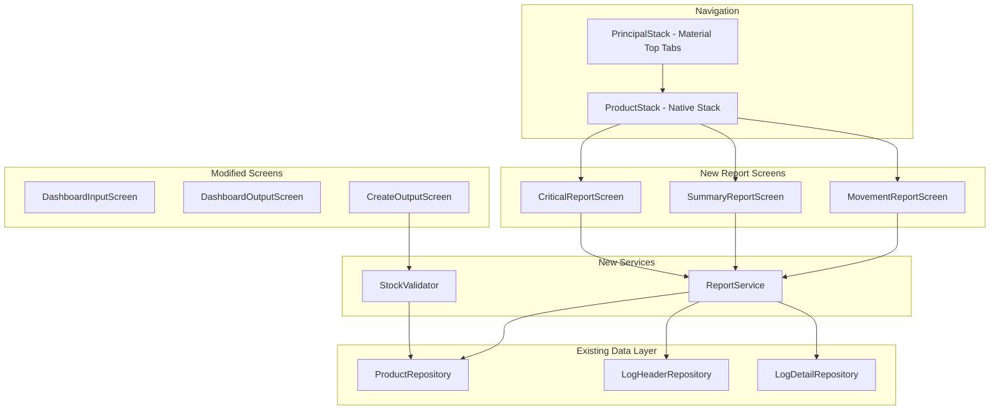

# Design Document: Dashboard Reports & Inventory Validation

## Overview

This design adds three capabilities to the Papalia Inventory app:

1. **Theme application** to existing DashboardInputScreen and DashboardOutputScreen (replacing hardcoded `appStyles` with `useTheme()` tokens)
2. **Three new report screens** (Critical, Summary, Movement) accessible from the ProductStack, providing at-a-glance inventory intelligence
3. **Stock validation** in the output (salida) flow to prevent negative inventory, with both real-time inline warnings and submission-time blocking

All new code follows the existing patterns: TypeORM repositories for data access, `useTheme()` for styling, native stack navigation, and Spanish-language UI text.

## Architecture



The report screens are added to the `ProductStack` navigator since they provide inventory overview information closely related to the product list. A "Reportes" entry point (button or menu) on the `ProductListScreen` navigates to the report screens.

The `StockValidator` is a pure validation module invoked by `CreateOutputScreen` both on quantity change (inline warning) and on form submission (blocking validation with Toast error).

## Components and Interfaces

### New Screens

| Screen | Route Name | Location |
|--------|-----------|----------|
| CriticalReportScreen | `CriticalReport` | `src/screens/reports/CriticalReportScreen.tsx` |
| SummaryReportScreen | `SummaryReport` | `src/screens/reports/SummaryReportScreen.tsx` |
| MovementReportScreen | `MovementReport` | `src/screens/reports/MovementReportScreen.tsx` |

### ReportService

**Location:** `src/services/ReportService.ts`

A pure data-fetching and computation layer. Each function queries the database and returns structured data ready for display.

```typescript
// Critical report data
interface LowStockProduct {
  code: string;
  name: string;
  stock: number;
}

interface MostMovedProduct {
  code: string;
  name: string;
  totalQuantity: number;
}

interface CriticalReportData {
  lowStockProducts: LowStockProduct[];    // stock <= 5
  zeroStockProducts: LowStockProduct[];   // stock === 0
  mostMovedProducts: MostMovedProduct[];  // top 10 by total quantity
}

// Summary report data
interface StockDistribution {
  zero: number;       // stock === 0
  low: number;        // 1-5
  medium: number;     // 6-20
  high: number;       // 21-50
  veryHigh: number;   // > 50
}

interface SummaryReportData {
  totalProducts: number;
  totalInventoryValue: number;  // sum(price * stock)
  totalUnitsInStock: number;    // sum(stock)
  stockDistribution: StockDistribution;
}

// Movement report data
interface MovementByType {
  typeName: string;
  totalQuantity: number;
  isInput: boolean;
}

interface MovementReportData {
  totalEntryQuantity: number;
  totalExitQuantity: number;
  movementsByType: MovementByType[];
  topCategories: MovementByType[];  // top 5 by totalQuantity
}

// Service functions
export async function getCriticalReportData(): Promise<CriticalReportData>;
export async function getSummaryReportData(): Promise<SummaryReportData>;
export async function getMovementReportData(): Promise<MovementReportData>;
```

### StockValidator

**Location:** `src/utils/stockValidator.ts`

A pure validation module (no React dependencies) that can be unit- and property-tested in isolation.

```typescript
interface StockValidationResult {
  isValid: boolean;
  errorMessage?: string;       // Spanish error for Toast on submission
  failedProductCode?: string;
}

interface InlineStockWarning {
  productCode: string;
  warningMessage: string;  // "Stock disponible: [stock]"
  hasWarning: boolean;
}

// Submission-time validation (checks all products, reports first failure)
export function validateStockForOutput(
  details: Array<{ productCode: string; name: string; quantity: number }>,
  currentStocks: Map<string, number>
): StockValidationResult;

// Inline validation (single product, real-time feedback)
export function checkStockForProduct(
  quantity: number,
  availableStock: number,
  productName: string
): InlineStockWarning;

// Format the submission error message
export function formatStockError(
  quantity: number,
  stock: number,
  productName: string
): string;
```

### Navigation Updates

**Modified file:** `src/interfaces/IProductNavigation.ts`

```typescript
export type ProductStackParamList = {
  ListProduct: undefined;
  CreateProduct: undefined;
  EditProduct: { id: string };
  CriticalReport: undefined;
  SummaryReport: undefined;
  MovementReport: undefined;
};
```

### Modified Screens

**DashboardInputScreen / DashboardOutputScreen:** Replace `appStyles.screen`, `appStyles.title`, `appStyles.textDark`, `appStyles.textCenter` with theme-derived styles via `useTheme()`. Follow the pattern already used in `DashboardItem`.

**CreateOutputScreen:** Add stock validation before calling `createLog`:
1. Fetch current stock for all products in the output details
2. Call `validateStockForOutput()` 
3. If invalid, show Toast with error message and abort
4. If valid, proceed with `createLog()`

**LogForm (output mode only):** Add inline stock warnings:
1. When a product quantity changes, call `checkStockForProduct()`
2. Display warning text styled with `theme.colors.error` below the affected detail item
3. Remove warning when quantity becomes valid

### Shared UI Components

**ReportCard:** A reusable card component for report sections.

```typescript
interface ReportCardProps {
  title: string;
  children: React.ReactNode;
}
```

Uses `theme.colors.surface`, `theme.borderRadius.md`, and `theme.elevation.low` — matching the existing `DashboardItem` pattern.

## Data Models

No new database entities are required. All report data is computed from existing tables:

- **Product** (code, name, description, price, stock, image)
- **LogHeader** (id, type, comments, createdAt, isInput)
- **LogDetail** (id, productCode, logHeaderId, name, quantity, price, total)

### Query Patterns

**Low stock products:**
```sql
SELECT code, name, stock FROM product WHERE stock <= 5 ORDER BY stock ASC
```

**Zero stock products:**
```sql
SELECT code, name, stock FROM product WHERE stock = 0
```

**Most moved products (top 10):**
```sql
SELECT productCode, name, SUM(quantity) as totalQuantity 
FROM log_detail 
GROUP BY productCode 
ORDER BY totalQuantity DESC 
LIMIT 10
```

**Summary computations:**
```sql
SELECT COUNT(*) as totalProducts, 
       SUM(price * stock) as totalValue, 
       SUM(stock) as totalUnits 
FROM product
```

**Stock distribution:**
```sql
SELECT 
  SUM(CASE WHEN stock = 0 THEN 1 ELSE 0 END) as zero,
  SUM(CASE WHEN stock BETWEEN 1 AND 5 THEN 1 ELSE 0 END) as low,
  SUM(CASE WHEN stock BETWEEN 6 AND 20 THEN 1 ELSE 0 END) as medium,
  SUM(CASE WHEN stock BETWEEN 21 AND 50 THEN 1 ELSE 0 END) as high,
  SUM(CASE WHEN stock > 50 THEN 1 ELSE 0 END) as veryHigh
FROM product
```

**Movement totals by type:**
```sql
SELECT lh.type, lh.isInput, SUM(ld.quantity) as totalQuantity
FROM log_header lh
JOIN log_detail ld ON ld.logHeaderId = lh.id
GROUP BY lh.type, lh.isInput
ORDER BY totalQuantity DESC
```

## Correctness Properties

*A property is a characteristic or behavior that should hold true across all valid executions of a system — essentially, a formal statement about what the system should do. Properties serve as the bridge between human-readable specifications and machine-verifiable correctness guarantees.*

### Property 1: Stock threshold filtering correctly partitions products

*For any* set of products with non-negative integer stock values, the low stock filter SHALL return exactly those products with stock ≤ 5 (and no others), and the zero stock filter SHALL return exactly those products with stock = 0 (and no others). The zero stock result must always be a subset of the low stock result.

**Validates: Requirements 2.1, 2.2**

### Property 2: Most moved products ranking is correct

*For any* set of log detail records, the "most moved" computation SHALL return at most 10 products, ordered by descending total quantity (sum of all their log detail quantities), and every product in the result must have a total quantity greater than or equal to any product not in the result.

**Validates: Requirements 2.3**

### Property 3: Inventory summary computations are accurate

*For any* set of products with non-negative price and non-negative integer stock, the summary computation SHALL produce: (a) totalProducts equal to the count of products, (b) totalInventoryValue equal to the sum of (price × stock) for all products, and (c) totalUnitsInStock equal to the sum of stock for all products.

**Validates: Requirements 3.1, 3.2, 3.3**

### Property 4: Stock distribution bucketing is exhaustive and exclusive

*For any* set of products, each product SHALL be classified into exactly one stock distribution bucket (0, 1-5, 6-20, 21-50, >50), and the sum of all bucket counts SHALL equal the total number of products.

**Validates: Requirements 3.4**

### Property 5: Monetary formatting produces valid output

*For any* non-negative numeric value, the monetary formatting function SHALL produce a string that starts with "Q", followed by a number with exactly two decimal places.

**Validates: Requirements 3.6**

### Property 6: Movement aggregation correctly groups by type and direction

*For any* set of log headers (with isInput flag) and their associated log details, the movement aggregation SHALL produce: (a) totalEntryQuantity equal to the sum of quantities for all details belonging to input headers, (b) totalExitQuantity equal to the sum of quantities for all details belonging to output headers, and (c) movementsByType where each type's totalQuantity equals the sum of quantities for details in that type group.

**Validates: Requirements 4.1, 4.2**

### Property 7: Top categories ranking is correct

*For any* set of movement records with at least 5 distinct types, the top 5 categories SHALL be ordered by descending total quantity, and every category in the top 5 must have a total quantity greater than or equal to any category not in the top 5.

**Validates: Requirements 4.3**

### Property 8: Stock validation correctly accepts or rejects based on available stock

*For any* product with a non-negative stock value and any requested quantity (positive integer), the stock validator SHALL reject (return invalid) if and only if the requested quantity exceeds the available stock. When quantity ≤ stock, validation passes. When quantity > stock, validation fails.

**Validates: Requirements 6.1, 7.1, 7.4**

### Property 9: Stock validation error message contains all required information

*For any* product name (non-empty string), stock value (non-negative integer), and requested quantity (integer exceeding stock), the formatted error message SHALL contain the quantity value, the stock value, and the product name.

**Validates: Requirements 6.2**

### Property 10: Inline stock warning message format

*For any* product with a non-negative stock value where the requested quantity exceeds stock, the inline warning message SHALL equal "Stock disponible: [stock]" where [stock] is the actual stock value.

**Validates: Requirements 7.2**

### Property 11: First-failing product is reported on multi-product validation

*For any* list of product details where multiple products exceed their available stock, the stock validator SHALL report the error for the first product in the list that fails validation, and the error message shall reference that product's name, quantity, and stock.

**Validates: Requirements 6.7**

## Error Handling

| Scenario | Handling |
|----------|----------|
| Database query fails in ReportService | Catch error, log to console, return empty/zero data structures. Screen shows empty state. |
| Stock validation query fails (cannot fetch current stock) | Treat as validation failure. Show generic error Toast: "Error al verificar el stock disponible". Do not proceed with createLog. |
| Product not found during stock validation | Treat as validation failure. Show error: "Producto no encontrado: [code]". |
| Report screen loads with no data | Display appropriate Spanish empty state message per requirement. |
| Theme context unavailable | Existing `useTheme()` hook throws with Spanish error message (already handled). |

## Testing Strategy

### Unit Tests (Example-Based)

- **Theme application:** Render DashboardInputScreen and DashboardOutputScreen, verify theme tokens are applied to key elements (not hardcoded colors).
- **Navigation:** Verify report screen routes are registered in ProductStack and navigable.
- **Empty states:** Verify correct Spanish messages when no data exists for each report section.
- **Toast on validation failure:** Verify Toast component is shown with type "error" when stock validation fails.
- **Validation ordering:** Verify `createLog` is not called when validation fails.

### Property-Based Tests (fast-check, minimum 100 iterations)

The project uses **Jest** with **fast-check** (v4.8.x) for property-based testing. Each property test mocks TypeORM decorators (matching the existing pattern in `formValidation.property.test.ts`) and tests pure computation/validation functions in isolation.

**Test files:**
- `__tests__/unit/services/ReportService.property.test.ts` — Properties 1-7
- `__tests__/unit/validation/stockValidation.property.test.ts` — Properties 8-11

Each test is tagged with:
```
Feature: dashboard-reports-inventory-validation, Property {N}: {title}
```

Configuration: `{ numRuns: 100 }` per property assertion.

### Integration Tests

- Report screens load data from SQLite via TypeORM repositories (using sql.js mock, matching existing pattern).
- Stock validation queries fresh stock values at validation time.
